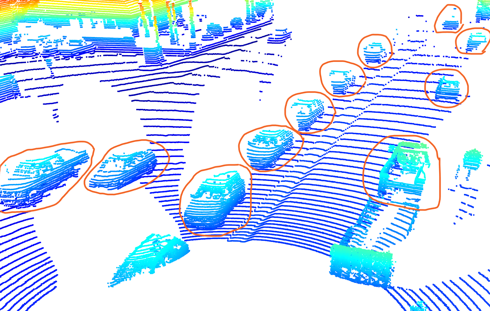
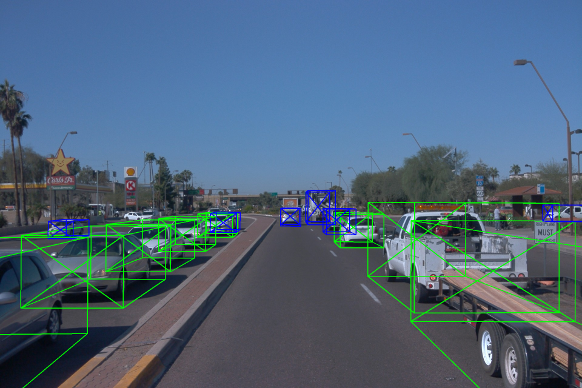
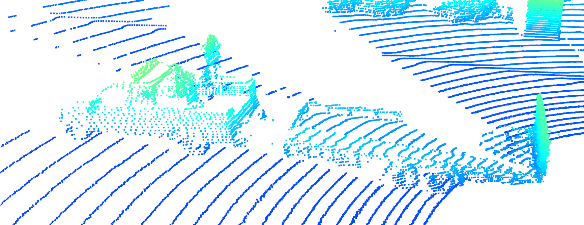
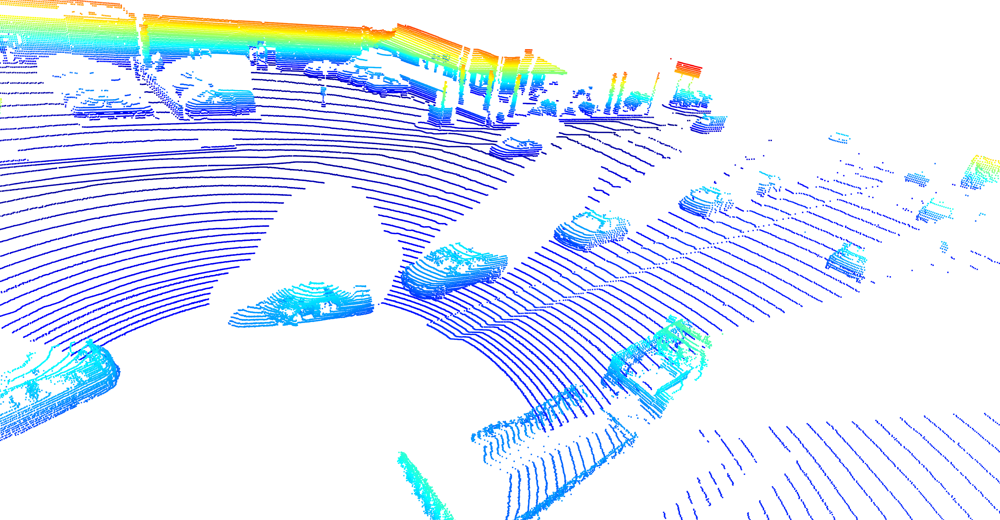
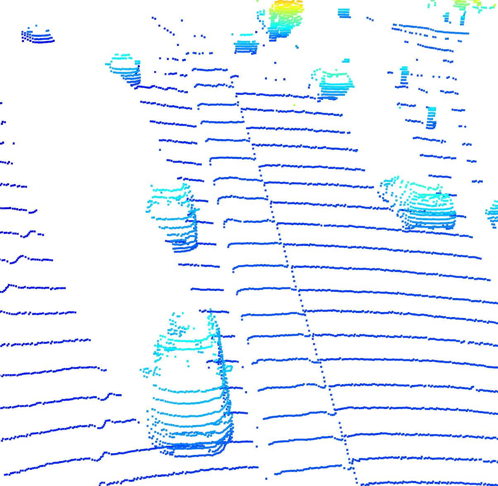

# Mid-Term Project: 3D Object Detection

The objective of this report is to discuss the discussion required in the Step 1 Part 2 of midterm project. It consists
of two major parts:

* Finding and displaying 10 examples of vehicles with varying degrees of visibility in the point-cloud
* Identifying vehicle features that appear as a stable feature on most vehicles (e.g. rear-bumper, tail-lights) and
  describe them briefly. Also, use the range image viewer from the last example to underpin your findings using the
  lidar intensity channel.

## 1. Finding and displaying 10 examples of vehicles with varying degrees of visibility in the point-cloud

### picture 1

  
  

From the above images, we can see that far the vehicle away is, the less visible it is in the point cloud.
Also, the truck trailer is a little bit challenging to detect since it has wheels but doesn't have body.

### picture 2

### picture 3

### picture 4

## 2. Stable features on vehicles

There are several features that appear as a stable feature on most vehicles. Some of them are:

* Rear-bumper
* Licence plate
* Car body

However, the car windshield is not a stable feature. It is not visible in all vehicles since the laser light can go
through it, and it appears as a hole in the point cloud.